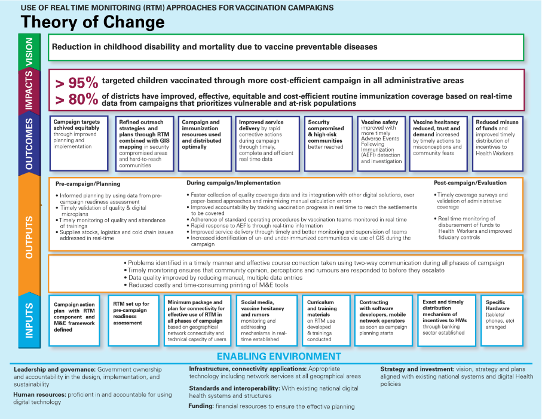
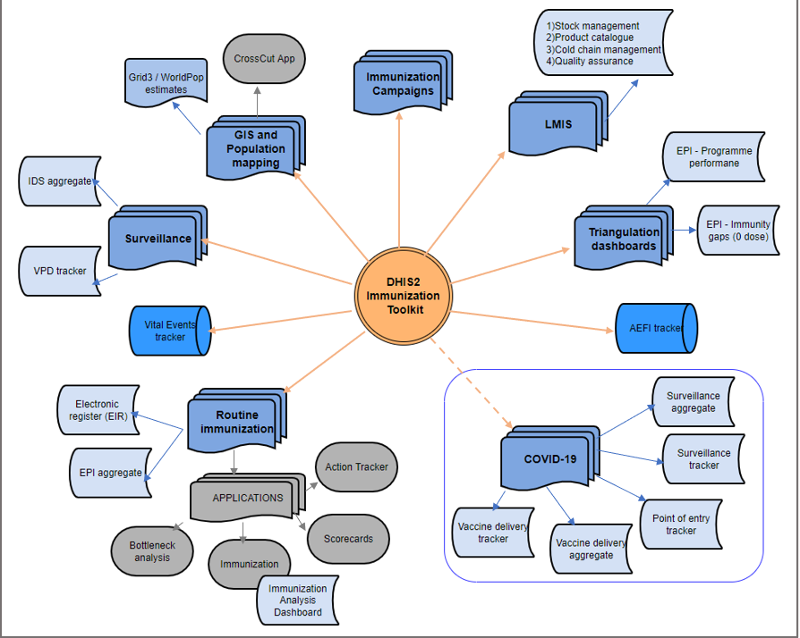
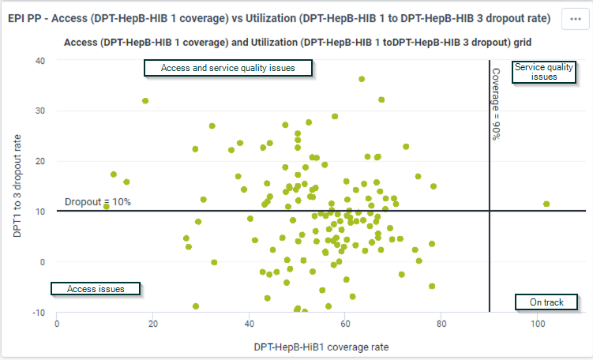
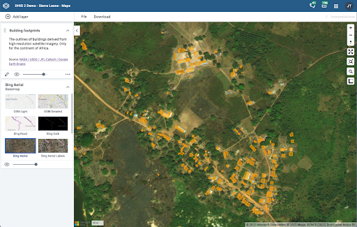
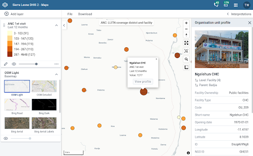
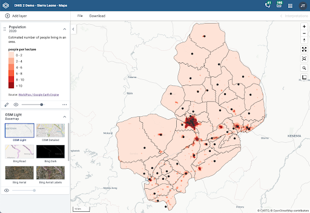
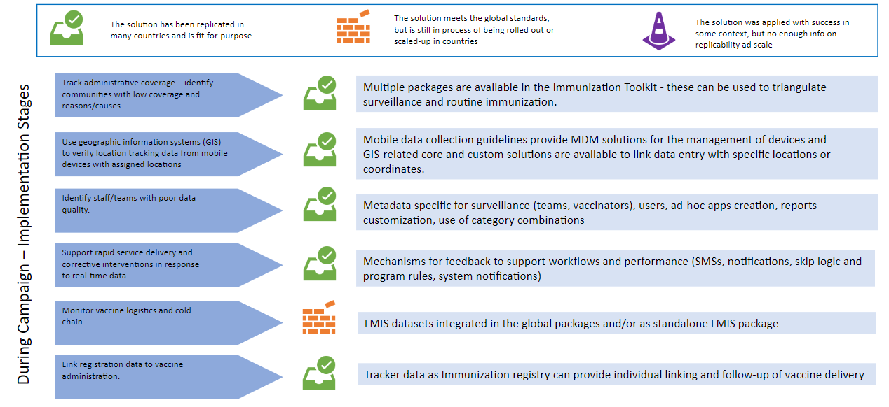
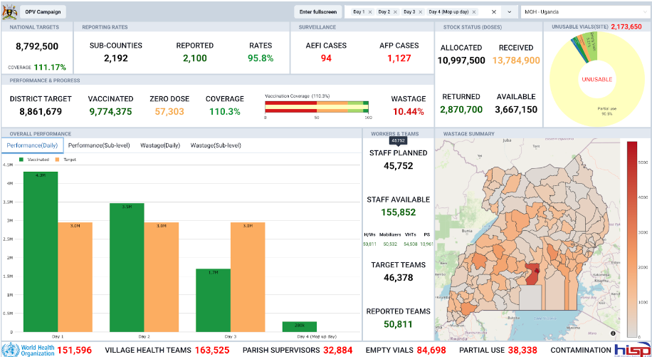
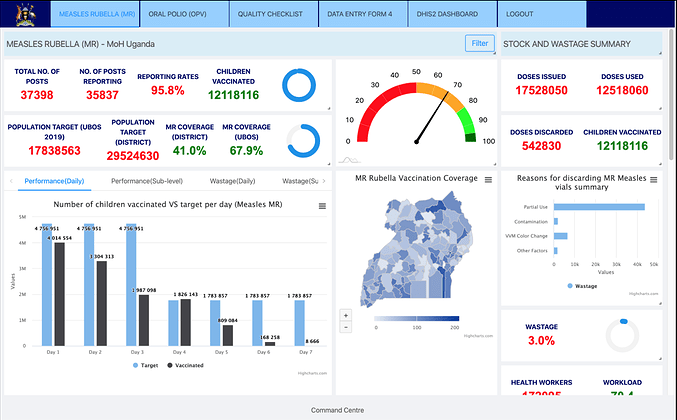
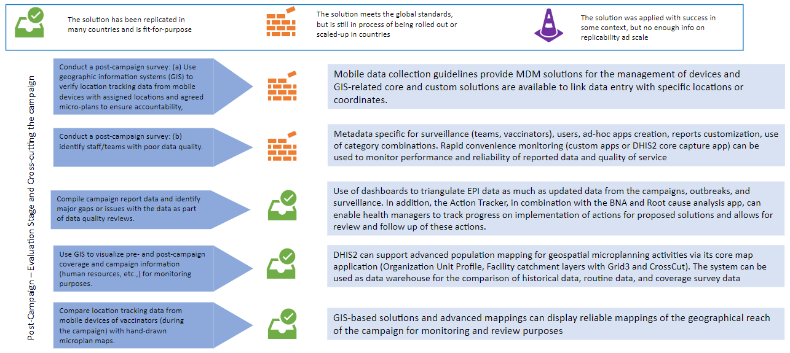

# Real-time Monitoring of Vaccination Campaigns - Use { #imm-vc-use }

## Introduction

The use of electronic digital tools to monitor preparedness and implementation in real time results in improving efficiency and effectiveness of vaccination campaigns ([UNICEF, 2021](https://www.gavi.org/sites/default/files/programmes-impact/evaluations/Digital-Technologies-Approaches-RTM-Supplementary-Immunization-Activities-UNICEF-Gavi.pdf)).  More than 50 countries have integrated routine immunization programme data into the national DHIS2 system. The availability of robust routine immunization data in national DHIS2 systems alongside surveillance data, denominator data sources such as census-based population estimates and immunization programme targets for facility catchment areas, and the GIS application (Maps App) for integrating mapping layers from outside DHIS2 can be used to effectively plan and evaluate **Supplementary Immunization Activities (SIA)**.

{ .center }

This document is intended to provide practical guidance to national immunisation programmes, national core HIS teams and DHIS2 implementers on **how to use DHIS2 to support the planning, implementation, real-time monitoring and evaluation of immunisation campaigns**. The document provides an overview of the various DHIS2 applications, WHO metadata, and functionality that can be used and customised for SIA. Throughout the document, **real-world examples from country implementations** are provided to demonstrate the use of these tools.

This guide is tailored to implementing DHIS2 for planning and real-time monitoring (RTM) of immunisation campaigns. For more general DHIS2 implementation guidance, please refer to link to the internal documentation [Implementation Overview](https://docs.dhis2.org/en/implement/implementing-dhis2/overview.html).

The recording of the [DHIS2 Immunization toolkit for SIAs webinar](https://www.youtube.com/watch?v=IOEL8pnM1Ko) provides an overview and summary of the guide.

### Acknowledgements

HISP Centre would like to extend its special thanks to the external partners who provided strategic and technical guidance, contributed content, and shared field lessons lessons learned to develop this guide: MOH Uganda, MOH Bangladesh, WHO, UNICEF, UNICEF Bangladesh, US CDC, MSF, HISP Rwanda and HISP Uganda. The development of the DHIS2 SIA guidance and toolkit is supported by Gavi, the Vaccine Alliance.

## Overview

The **DHIS2 Immunization Toolkit** developed in partnership with WHO, UNICEF and CDC includes a range of configuration packages, dashboard designs, and analysis apps to support the use of routine and non-routine data to improve immunisation programme performance, increase coverage and reduce the number of zero-dose children. This document outlines the DHIS2 tools that can be used and adapted for planning, implementing, real time monitoring, and evaluating SIAs.

{ .center }

## Pre-Campaign: Planning

Planning for any SIA should include a plan for the information systems, data sources and tools required to support a real-time monitoring (RTM) component and M&E framework. RTM components supported by DHIS2 may include the development of a micro-plan, campaign logistics planning, generating real-time monitoring data, presenting data to SIA managers, field operations and programme staff, and integrating key data outputs such as campaign coverage back into the national information system post-campaign.

The following steps should be considered when planning a digital RTM component:

- **PLANNING** with stakeholders includes operational and budget considerations accounting for frequency of data collection, hardware and connectivity, end user training required, field support mechanisms, and human resources for data management and use. This phase should include EPI data managers as well as core national HIS teams who have expertise and knowledge of DHIS2 and the routine immunisation information system.
- **DESIGN CONSIDERATIONS** should take into account campaign operation structures (hierarchy), the relevant metadata and outputs for implementation and decision making, data collection workflows, whether the campaign will involve Android vs web data entry (or a hybrid), and user configuration & management aspects.
- **TESTING** prior to roll-out is of paramount importance and should include end user acceptance testing, testing of the configuration and performance testing prior to deployment.
- **TRAINING**: Training of trainers (ToTs) and plans to cascade training to target field teams for data collection, supervisors for monitoring, and training for first-line support staff troubleshooting on the ground. Leveraging in-country expertise in DHIS2 at national and subnational levels for cascaded training to campaign staff can reduce training costs.
- **COMMUNICATION & SUPPORT STRUCTURES** between command centre and field operations to ensure automated, targeted feedback mechanisms to users at lowest levels at all stages of the implementation and allow users to access front-line support. These should also include feedback loops for performance monitoring as well as data quality checks for completeness and accuracy.

A thorough **checklist for the assessment of the readiness** of a SIA planning phase in a variety of contexts is available in the [Annex 2 of the “Planning and implementing high-quality supplementary immunization activities for injectable vaccines using an example of measles and rubella vaccines: field guide”](https://www.who.int/publications/i/item/9789241511254) documentation (WHO, 2016).

{ .center }

### Triangulation & Use of Routine Data for Planning

**Routine data** captured in the national DHIS2 system is a key source for identifying **low-coverage areas, under-immunised populations and zero-dose children**. These data are critical inputs for campaign planners to combine with other sources [UNICEF, 2021](https://www.unicef.org/media/93781/file/gavi-unicef-digital-technology-immunization-2021.pdf). DHIS2 is widely used as a routine system for immunisation and surveillance data, with many countries having adopted WHO-recommended standards for analysis that can be referenced through the following metadata packages for DHIS2:

- [**EPI data**](https://docs.dhis2.org/en/topics/metadata/immunization/immunization-aggregate/design.html): routine facility data on vaccine doses administered (including for outreach sessions) and stock; dashboards to analyse coverage, drop-out rates, vaccine wastage and more
- [**IDS aggregate package**](https://docs.dhis2.org/en/topics/metadata/disease-surveillance/ids-aggregate/version-120/design.html): aggregate weekly surveillance data for vaccine-preventable and epidemic-prone diseases
- [**VPD tracker package**](https://docs.dhis2.org/en/topics/metadata/disease-surveillance/vpd-case-surveillance-tracker/design.html): case-based data for 9 VPDs, including laboratory data linked to case reports & final classifications where available

The image below exemplifies the type of routine information that is typically available in national DHIS2 systems for campaign planners. This visualisation can be generated by routine EPI data reported to the HMIS, allowing users to compare coverage and drop-out rates and identify areas or sites where access and service quality issues may indicate under-immunised populations.

{ .center }

> **Example**
>
> **DHIS2 IN USE:**
>
> **Togo implemented the DHIS2 immunisation package and data quality tools**. This change resulted in **improved reporting rates and deadlines for EPI data**. As this data is now available to a wider audience, it is seen as a 'common good' that can be used for further analysis by including dashboards capable of triangulating immunizations, inventory data and outreach performance.These dashboards in particular support the identification of areas with high incidence of unvaccinated children to enable more targeted immunisation programmes. More information on the uptake and triangulation of immunisation tools for planning in Togo is available on the [DHIS2 website](https://dhis2.org/togo-immunization-package/).

#### Triangulation dashboards

DHIS2 triangulation dashboards combine data from multiple sources and present them to the user for analysis. These can be used to support the **identification of low-coverage communities and zero dose children**. The Immunity Gaps dashboard contained in the [**Triangulation dashboards for immunization programmes**](https://docs.dhis2.org/en/topics/metadata/immunization/immunization-triangulation-dashboard/design.html) package is available to provide a useful template for the triangulation of immunisation and surveillance data, based on recommendations Visualisations and maps included

Further info on the utility of triangulation dashboards can be found in the recordings of the [CDC presentation](https://www.youtube.com/watch?v=AVxhJO41BXs) given at the DHIS2 Annual Conference 2022.

> **Example**
>
> **DHIS2 IN USE:**
>
> Since 2022, DHIS2 has been introduced at all levels of the health system by the **Ivory Coast EPI and Surveillance teams**. After a process of data harmonisation, the data coverage, aggregate and case-based VPD surveillance, and vaccine stock data from 2009 to 2019 were compiled in the system for an internal triangulation exercise to identify measles immunity gaps at the sub-national level.The results of such activity **helped inform decisions regarding the introduction of a second dose of measles vaccine and revised target population estimates**.
More information on the triangulation activities in Ivory Coast are available in the [DHIS2 Community of Practice](https://community.dhis2.org/t/triangulation-and-use-of-immunization-data/47519).

### Apps for enhanced analysis

The following custom DHIS2 applications can also be used to visualise and analyse routine and other data sources available in the HMIS during the campaign planning phase. These apps are optional and must be installed on a DHIS2 instance and configured for use with an existing country system.

[**IMMUNIZATION APPLICATION**](https://docs.dhis2.org/en/topics/metadata/immunization/immunization-analysis-app/app-version-103/user-manual.html) and the immunisation dashboards integrated within the aggregate EPI package from V 1.0.0 can be a relevant **source of data triangulation** for the monitoring of drop-outs and immunisation coverage by vaccine type.

[**SCORECARDS**](https://docs.dhis2.org/en/full/use/optional-apps/interactive-scorecard-ap-manual.html): The Scorecard app was developed primarily to **target district level managers as key end users**, and facilitate district level staff to query to query, interpret and act on routine health information data in DHIS2. Properly **identifying gaps in service delivery** is critical during the planning phase of immunisation campaigns. Using the [scorecard](https://docs.dhis2.org/en/topics/tutorials/creating-scorecards-with-pivot-tables.html) to drill down to facility level performance indicators can help campaign planners and district staff use data at a highly granular geographic level (e.g. facility catchment area, community).

{ .center }

**Data triangulation and scorecards** could be combined to further improve the analysis of the immunisation program and identify the priority areas for improvement. A good example is outlined in Table 1e of Annex 2 found in the **RED (“Reaching Every District'') documentation**. The appendix could be turned into a colour-coded pivot like the screenshot above using the thresholds provided in the same guide while plotting in the same table data on surveillance and target population(s) [(WHO AFRO, 2017)](https://www.afro.who.int/publications/reaching-every-district-red-guide-increasing-coverage-and-equity-all-communities).

[**BOTTLENECK ANALYSIS APP**](https://docs.dhis2.org/en/use/optional-apps/bottleneck-analysis-app/app-version-122/introduction-and-usage/analysis-and-interpretation.html)
Bottleneck Analysis (BNA) is a structured **results-oriented analysis of the determinants of the coverage**. The [Bottleneck Analysis app](https://www.youtube.com/watch?v=wGut3_l1JBo) facilitates systematic analysis ahead of programming.

[**ACTION TRACKER APP**](https://docs.dhis2.org/en/full/use/optional-apps/action-tracker-app.html)
An example of how the scorecard [action tracker](https://www.youtube.com/watch?v=AH3q33KsMmc) can be used is a **structured approach to identifying candidate facilities for SIAs** by looking at indicators that are red (i.e. under performing) across all sub-counties. Accompanied by a microplan plan, the app can not only help national and subnational levels identify capacity gaps to improve health metrics, but can also help county health management teams work with partners to support remedial capacity building sessions. Please note that the Action Tracker App is dependent on the BNA app implementation. All actions to be listed on the Action Tracker App must be referencing bottlenecks identified using the BNA app.

More information about the rationale and examples of use of these three apps can be found in the [“Webinar on DHIS2 Scorecard, Bottleneck Analysis, and Action Tracker Apps”](https://www.youtube.com/watch?v=Tpth5CndhAo).

{ .center }

### Geoenabled Microplanning { #geoenabled-microplanning }

WHO defines a microplan as an integrated set of components created to support activities performed during a public health campaign. Generally a microplan should take in consideration a series of domains which build to a master plan: resource estimation, cold-chain logistics, operations, supervision, recording and reporting tools, and monitoring framework ([WHO, 2016](https://apps.who.int/iris/bitstream/handle/10665/330568/9789241511254-eng.pdf?sequence=1&isAllowed=y) and [WHO AFRO, 2009](https://apps.who.int/iris/bitstream/handle/10665/70450/WHO_IVB_09.11_eng.pdf?sequence=1&isAllowed=y).

Comparison of various population data sources (e.g. census data, household survey data if available, Google Earth engine, World Pop/GRID3 mapping layers, etc) and layer over facility catchments to identify populations with limited geographic access to clinical services. More information on maps are available [here](https://docs.dhis2.org/en/use/user-guides/dhis-core-version-235/analysing-data/maps.html) and in the next chapter on microplanning. The wide range of uses of DHIS2 can also support the juxtaposition of service data with data coming from other domains, e.g. education or other data sources that have children counts.

Successful health campaigns often fail to meet established health care goals due to poor population estimates. The inability to find out where the target group is located hinders the chances of achieving the goals of a health campaign ([Deardorff, 2018](https://doi.org/10.1371/journal.pntd.0006211)). Better, more accurate information about population size and location allows for more favourable cost forecasting  and impact assessments of campaign-based interventions ([WHO AFRO, 2009](https://apps.who.int/iris/bitstream/handle/10665/70450/WHO_IVB_09.11_eng.pdf?sequence=1&isAllowed=y)).

The microplan contains technical details that can be tailored to the needs of the health system at all levels, including national institutions and healthcare professionals. It needs to work with medical services, usually health centres, at the operational level,  and the details of its implementation need to take into account the actual situation of  field operational staff. **To develop an effective microplan framework there is the need for detailed geographical data on population estimates, as well as  healthcare facilities and sites administering  health campaign services** ([Hernandes Rocha, 2021](https://doi.org/10.1016%2Fj.vaccine.2021.09.018)).

#### Population Estimates

Traditional microplanning endeavours rely on census estimates to define the population targeted for a particular health campaign. Nevertheless, many countries do not have the resources to obtain population data more routinely than every 5-10 years.
To overcome the shortage of up-to-date population distribution data, recent geospatial advances are helping to produce **detailed population estimates** around the world with top-down or bottom-up datasets. The main advantage of this approach is the use of satellite data and imagery as an input estimate for the population of a particular region (Boo, 2022).

DHIS2 can support advanced population mapping for geospatial microplanning activities via its [**core map application**](https://docs.dhis2.org/en/use/user-guides/dhis-core-version-master/configuring-the-system/maps.html):

- Vaccination campaigns typically need to address specific age groups within a population. Detailed population estimates by age and gender are available using resources such as [**Grid3**](https://grid3.org/) and [**WorldPop**](https://www.worldpop.org/)

{ .center }

> **Example**
>
> **DHIS2 IN USE:**
>
> **Uganda** has implemented DHIS2 not just as a health information system, but also as an **education information system (EMIS)**. The Ugandan EMIS collects their data on annual statistical forms. This data, that includes learner enrolments, staff, infrastructure, textbooks, special needs learners etc, is then entered into the DHIS2 at the district level. This is analysed and key indicators presented on dashboards. During vaccination campaigns, the entire district is involved in the micro-planning activities - this includes both the district health team and district education team, under the guidance of the district leadership.

In Uganda schools are usually vaccination posts. As health teams needed the number of children within the target age group who attended each school, **the district education team was able to extract and share the enrolment numbers of the target age group with the district micro-planning team to set the coverage targets and quantify the commodities and logistics needed for each school vaccination post**.

The district education team later stated that all the school vaccination posts with data from DHIS2 had adequate stock for the vaccination campaign. More information about this use case is available in the [data use session recording](https://community.dhis2.org/t/dhis2-annual-conference-session-on-data-use-in-practice-sharing-stories/43254/10) from the DHIS2 Annual Academy 2022.

- Structure maps via **Google Earth engine** - The dataset contains 516M building detections, across an area of 19.4M km2 (64% of the African continent).
While the import of data from Google Earth will become part of the core analytical capacity of DHIS2 (**version 2.39**), there is also an application that can be used - [**Google Earth Engine Data Importer**](https://apps.dhis2.org/app/f0cd4b99-db98-460d-9d5a-8e526fdf8b50). This app will allow all google earth engine data to be imported in order to be able to visualise them in other analytics and use them in indicators.

{ .center }

These numbers are obtained by applying algorithms to spatial variables and data from previous censuses and satellite images to create a grid dataset.To know more about advanced population mapping, you can check two key webinars:

- [Immunization webinar on microplanning solutions and innovations](https://www.youtube.com/watch?v=EjnxRxG5iHs)
- [Advanced population mapping](https://www.youtube.com/watch?v=DpQmOK4mYCA)

Both are available in English and French in the DHIS2 Youtube channel.

#### Considerations on Population Data and Denominators

As mentioned above, population estimates can be extrapolated using different tools and approaches, but the access to the right numbers is not the only limitation when it comes to the implementation and monitoring of vaccination campaigns.
One very important and often overseen detail is the effect of **periodicity** on the resulting outputs of the campaign. The **standard** periodicity of the system for population data is virtually always set at **annual level and either at district or national level**. The periodicity of the **campaign** can variate from **daily to weekly depending on resources and needs**. Moreover, the outputs of the campaign are, especially during real-time monitoring, analysed based on **vaccination sites**, which is a different administrative level from the level where the population data is routinely assigned.
For the purpose of maintaining reliable outputs it is therefore **crucial to align the periodicity and the level of assignment of the population data**.

Examples of the use of data and denominators are available in the quarterly webinar [“Data use, denominators and immunization”](https://community.dhis2.org/t/upcoming-webinars-on-data-use-denominators-and-immunization-in-english-et-en-francais/49491), during which HISP researchers shared findings from a systematic review of how denominator data is used in practice, with a focus on less frequently used approaches that are the most likely to identify the excluded/zero dose populations.

#### Geographic Localization of Health Facilities & Vaccination Sites

For countries that use DHIS2 as an HMIS, a master facility list is typically already incorporated to form the [**organization unit hierarchy**](https://www.youtube.com/watch?v=UDwmYw0W9gg) and is largely maintained due to the demand for ongoing routine reporting from facilities. Reusing the existing organisation unit hierarchy for higher administrative levels and health facilities not only saves time and effort, but also facilitates data analysis & integration with routine immunisation data captured in the HMIS in the post-campaign phase.

The geographic positioning of medical facilities can bring similar issues to the ones outlined in the “Population Estimates'' section. In particular, there are two levels that need to be considered when setting up the microplanning of a campaign : **where vaccination points (facilities, communities, schools, or any other structure) are located, and how to build them in the Organizational Unit hierarchy**.

DHIS2 provides a few solutions to the localization problem:

- [Organization Unit Profile](https://docs.dhis2.org/en/develop/using-the-api/dhis-core-version-master/org-unit-profile.html) - visualisation of key information on health facilities

{ .center }

- Facility catchment layers with [Grid3](https://grid3.org/) and [CrossCut](https://crosscut.io/)
[Crosscut application](https://apps.dhis2.org/app/de19ff76-3459-4ec1-a881-5b8644cd6c51) to generate and draw facility catchments. (Factors in road conditions, driving time, walking time,terrain, river crossings, and land cover)

{ .center }

> **Example**
>
> **DHIS2 IN USE:**
>
> **Bangladesh** was the first country to fully count on DHIS2 for the planning, monitoring, and analysis of the **measles/rubella mass campaign** conducted between the 12 December 2020 and 31 January 2021 to vaccinate 34,061,291 children from 9 month to <10 years and to achieve > 95% coverage of target children. Based on the **geographical information** available and the set-up of vaccination centres in high and low risk areas, the locations were then linked to core data such as the number of children, the vaccinators, the supervisors, and the porters. All these data, triangulated with the desired targets, were able to automatically populate the LMIS with information required to carry out the vaccination sessions, and to allow the supervisors to manage in real time the coverages and the eventual gaps. [For more information on the use of DHIS2 in the Bangladeshi microplan, please refer to the Community of Practice post](https://community.dhis2.org/t/use-of-dhis2-for-online-microplanning-real-time-monitoring-in-mr-campaign-2020-bangladesh/43206).

Geospatial microplanning is an invaluable asset when using geospatial data and technology, including geographic information systems (GIS), to support planning and monitoring of service delivery at the local level in health care facilities and health care districts.
Via the use of spatial data on the location of populations, medical resources, and the area around them in a GIS environment, digital micro-planning can ensure that all population groups are present, identify gaps in equitable reach to care and optimise outreach plans to ensure service equity and access.

## During Campaign: Implementation

### Real-Time Monitoring

Real-time monitoring (RTM) employs **digital technologies to accelerate the sharing, analysis and use of data to improve the quality of vaccination campaigns** ([Ramalingam, 2017](https://www.usaid.gov/sites/default/files/documents/15396/RTDAM_Briefing_Paper.pdf)). When used during the implementation phase of a campaign, digital real-time monitoring solutions can help campaign staff review progress against targets in near real-time; quickly identify issues and gaps; plan and redistribute supplies, human resources and vaccine sessions; and make prompt decisions about corrective actions ([Oh et al., 2016](https://www.cdc.gov/mmwr/volumes/65/wr/mm6539a5.htm)).

{ .center }

> **Example**
>
> **DHIS2 IN USE:**
>
> A typical example of vaccination campaign data based on the DHIS2 has been implemented in **Uganda**. DHIS2 was used for data collection with **custom dashboards** built on DHIS2 for real time data visualisation in the campaign carried out in 2021.  The latest campaign conducted was for nOPV and for this campaign a **daily aggregate data collection tool** was used to aggregate and report data at sub-national level.
>
> The data elements collected by this tool included **Doses administered, Children immunized (0-59 months), Children immunized (previously Zero Dose),Staff available, AFP cases, AEFI cases (severe, non-severe), Stock: Vials received, Wasted vials at the vaccination site, Physical stock count of vials on-hand, Vials returned (to store), Usable vials returned, Wasted vials returned.**
>
> In addition to this reporting tool, each of the reporting sub-national units was given targets during the microplanning process, these targets were uploaded into the system and indicators configured in the DHIS2 to monitor attainment of this target during the four-days national campaign. **The data elements for the targets generated from microplanning include: nOPV Vaccination teams, nOPV Doses, nOPV droppers, nOPV Population (0-59 months), nOPV Vials, Total projected population, Number of staff available**.
Based on these two data sets and the data elements, a custom dashboard was developed and used to monitor the campaign. The rationale is developing a custom dashboard as opposed to using the native DHIS2 dashboard to be able to display real-time data as it is being reported. Currently with the native DHIS2, analytics tables must be generated and web browsers refreshed before data values can be displayed. With the help of a custom dashboard application (shown in the image below), data in DHIS2 are displayed in real-time.

{ .center }

> **Example**
>
> **DHIS2 IN USE:**
>
> The MR mass campaign in **Bangladesh** covered more than 34,000,000 children. The need for effective **supervision** was therefore a must. During the campaign the supervisors’ checklists were digitised using the DHIS2 Android Capture app. Similarly, the household visits the day after the vaccination carried normally by 1st line supervisors were recorded through an **DHIS2 android capture app called “Household Visit”**.

Finally, the traditional paper-based Rapid Convenience Monitoring tool was aso digitzed using the DHIS2 Android Capture app for real-time data entry by campaign managers, who were easily and quickly able to confirm key information such as vaccinated children disaggregated by sex.  
To discover more about the monitoring and supervision tools used during the Bangladeshi campaign, please refer to the [Community of Practice post](https://community.dhis2.org/t/use-of-dhis2-for-online-microplanning-real-time-monitoring-in-mr-campaign-2020-bangladesh/43206).

### Offline Data Collection & Mobile App

**Network connectivity** has been identified as a **common challenge** through systematic reviews of RTM activities conducted by UNICEF (2021). DHIS2 can be implemented in hybrid paper/electronic reporting scenarios. For offline data capture, the DHIS2 Android App can be used and will reflect the configuration of the DHIS2 instance. There is no need for interoperability layers when using the DHIS2 Android application. Data can be synced when the device regains connectivity, for example when vaccination teams return to district or sub-district command posts at the end of each working day. Alternatively, there are also mechanisms for submitting data captured through the Android app via SMS or USSD in low connectivity settings.

Documentation on deployment strategies and use of the DHIS2 Android app are found in the [DHIS2 Android User Guide](https://docs.dhis2.org/en/use/android-app/about-this-guide.html) and [DHIS2 Android Implementation Guide](https://docs.dhis2.org/en/implement/android-implementation/about-this-guide.html).

### Data Quality & Approval Apps

Country case studies on RTM have revealed challenges among field teams accessing their data on the same day due to requirements for central level data cleaning, downloading and approval (UNICEF, 2021). Core DHIS2 applications for **data quality and approvals** can also be used as part of an RTM implementation to allow data to be made immediately accessible to users closest to the ground, while also accommodating workflows for data validation, approval, and presentation of approved data to various groups of users.

- The [**Data Approval**](https://docs.dhis2.org/en/use/user-guides/dhis-core-version-238/approving-data/data-approval.html) app can be used to allow supervisors, district and national staff the possibility to approve data submitted on a daily basis during the campaign through the hierarchy of reporting.

- The [**Data Quality App**](https://docs.dhis2.org/en/use/user-guides/dhis-core-version-238/collecting-data/data-quality.html) allows users with the appropriate access to configure, run and check data validation rules; and to conduct outlier detection based on a number of configurable parameters. The utility of feedback mechanisms and their impact on the [quality of data](https://docs.dhis2.org/en/implement/chis-implementation/data-quality-and-use.html) in the context of community health worker programmes is well documented and lessons learned can be applied to campaign staff.

> **Example**
>
> **DHIS2 IN USE:**
>
> After the completion of the **Polio Mass Vaccination in Mozambique**, the teams involved in the activity gathered for **three days of data quality assessment** (data cleaning and validation). During the campaign validation rules ensured the logic within the reported number, although the data needed to pass a validation step for the numbers to be approved and submitted to the team at central level.
These steps ensured timely, reliable, and actionable data to be used and monitored during the campaign.
After the campaign the teams went through a second phase of data quality checks before closing the campaign activities. While the coverage was assessed daily by supervisors, the post-campaign assessments relied on triangulation of data at district and provincial level and the cross check of number directly by the teams who reported them in first place.

### RTM Dashboards & Analytics Tools

The real time monitoring of SIA activities is of paramount importance to trigger a decision-making process. Information such as the number of sites reporting or the number of administered doses vs. the targets set during the microplanning (e.g. the number of children vaccinated during the day or the number of reporting sites) should be evaluated at least daily in order to evaluate the [quality](https://docs.dhis2.org/en/implement/database-design/data-quality.html) of the reported data, and to create a cascade of actions and discussions [UNICEF, 2021](https://www.unicef.org/media/93781/file/gavi-unicef-digital-technology-immunization-2021.pdf).

#### Dashboards for Real-Time Monitoring

Dashboards are part of the core functionalities of DHIS2 for the grouping and displaying of analysis items such as pivot tables and graphs. Virtually all standard global packages are released with a dashboard (or multiple dashboards) designed on the basis of key metrics. Just as the global packages could be re-used and adapted for the purpose of SIAs, dashboards could also be uptaken and repurposed with the parameters of campaign-specific metrics according to the local needs. Moreover, dashboards could also be customised with custom dashboard apps in order to tailor the UI experience as much as possible.

From DHIS2.37, [offline dashboards](https://docs.dhis2.org/en/use/user-guides/dhis-core-version-237/analysing-data/dashboards.html#making-dashboards-available-offline) are supported in the web dashboard application and the mobile Android capture app. This is of great importance especially for the vaccination teams as they can be kept updated and can bring all the relevant information (e.g. targets, supply, staff info) in their pockets.

> **Example**
>
> **DHIS2 IN USE:**
>
> A [**custom DHIS2 dashboard app developed by HISP Uganda**](https://dhis2.org/uganda-mr-polio-vaccination/) played a key role in the success of Uganda's vaccination campaign. This ensured the **transmission of real-time data from immunisation centres to national and regional command centres**, which were used for real-time [decision making](https://community.dhis2.org/t/information-for-action-dashboards/37340). As an example, leaders at the National Command Center found that the number of children vaccinated was falling short of targets. Information on the ground suggested that this was due to the large number of children in the target population combined with a widespread fear of needles. Therefore, it was decided at the right time to extend the campaign period by another two days.

{ .center }

### RTM Feedback Mechanisms for Field Staff

The use of digital tools for the data entry, **monitoring and supervision of the campaign can also have the potential to improve the communication between the field and the higher levels of decision making**. Data becomes more transparent and both parties are equally involved in the build-up of solid evidence via a simplified way to communicate and disseminate information to the key stakeholders involved in the campaign (vaccinated people and their families, data collectors, supervisors, program managers, or policy makers) [(Tiwari, et al., 2017)](https://doi.org/10.4269%2Fajtmh.16-0612). Feedback mechanisms should be customised for context to best deliver characteristic-based stakeholder information and their needs. Feedback mechanisms should also consider users who may not have access to DHIS2 through a computer or smartphone, but are engaged in campaign efforts such as community members.

In the context of vaccination campaigns, these mechanisms can take the form alerts to inform data encoders that the data has been successfully submitted, of skip logic and program rules to support vaccinators to better identify eligible children, of feedback widget where to display preconfigured messages (if using tracker), or of internal system notifications to supervisors to remind them to approve the data. supervisors could get notifications (SMS, email, or system notification) to start their household visits and rapid convenience monitoring activities; lists of locations can be created to have easy overviews of low coverage; program managers could give feedback directly in the items of the dashboards and tag other users; supply barriers could trigger alerts to logistics and supply managers to intervene immediately.

Many of the DHIS2 functionalities and tools used to establish [feedback loops with community health workers](https://docs.dhis2.org/en/implement/chis-implementation/data-quality-and-use.html#3-strengthening-feedback-mechanisms) can also be re-oriented for use during a campaign to establish real-time, bi-directional communication between campaign supervisors, field staff and the community [(Biemba et al., 2017)](https://pubmed.ncbi.nlm.nih.gov/28855233/). Key functionalities to support real-time feedback mechanisms with field staff include:

- Configurable **system-generated notifications** based on data validation rules and program stage notifications can be sent to predefined user groups
  - **Validation rule alerts**: Validation rules can be used for many purposes. Data quality checks is the most common practice, but validation rules can be used for programmatic alerts as well. For example, a validation rule "Doses available !== 0". In this case any instance where a vaccination site has no doses on hand can be prioritised for restocking. A user group such as Campaign Supervisors can receive automated validation rule alerts that one or more campaign sites/operational units require follow up.
  - **Reminder to submit data**: It is typically a good practice to send reminders to facility and community health workers to submit their routine data via SMS. This can be replicated for groups of campaign workers, e.g. to alert a Supervisor if an operational unit has not entered any data and may require follow-up.
- An **SMS gateway** that can be configured to send and receive messages to/from DHIS2
- **Program rules** configured to display warnings or messages for retrospective/secondary data entry users (typically focusing on data quality) or basic decision support for real-time electronic data entry

### Vaccine Hesitancy & Demand Generation

During a campaign, interventions may be taken to reduce vaccine hesitancy, generate demand, reduce drop-outs, and facilitate communication with community members.

> **Example**
>
> **DHIS2 IN USE:**
>
> **Combating Vaccine Hesitancy in Côte d’Ivoire**
With support from the BreakthroughACTION project, DHIS2 was deployed as a real-time rumour monitoring system in Cote d’Ivoire. Using the DHIS2 Event model, anonymous rumours and ad hoc data can be reported into the system. These were classified and grouped to provide valuable insights to risk communication staff and community engagement actors to analyse themes, beliefs (as well as their frequency) and provide targeted messaging to groups in different locales. The system involved the community while enabling confidentiality, with rumours reported through hotlines, key informants and social networks. <https://dhis2.org/ivory-coast-covid-communication/>

### DHIS2-RapidPro Integration

RapidPro is a global good that has been used effectively in numerous countries and use cases to facilitate field-level communications and improve in health, education, nutrition, WASH and vaccination (UNICEF, 2019). DHIS2 core support for integration with RapidPro (underway) is anticipated to further enhance the ability of implementations to link the information systems platform (DHIS2) with effective bi-directional communication tools (RapidPro).
A [webinar](https://www.youtube.com/watch?v=Yvkvyefa3fo) and the [CoP post](https://community.dhis2.org/t/webinar-on-rapidpro-dhis2-integration/51924) to it related are available for further information on the integration of DHIS2 and RapidPro.

### DHIS2 Tracker

The following DHIS2 tracker designs support an electronic immunisation registry and can be re-used and modified as needed for recording individual-level vaccinations during a campaign, if determined feasible. If a country already has a routine Tracker-based EIR in place, it may be desirable for these vaccinations to be recorded in the national EIR in parallel to a DHIS2-based real-time monitoring solution.

- [Electronic Immunization Register (EIR)](https://docs.dhis2.org/en/topics/metadata/immunization/eir-immunization-eregistry/design.html) for routine child immunisation
- [COVID-19 Vaccine Delivery Tracker](https://docs.dhis2.org/en/topics/metadata/covid-19-vaccine-delivery/covid-19-electronic-immunization-registry-tracker/design.html) was created in response to the COVID-19 pandemic and the national scale mass vaccination campaigns.

While the EIR could potentially be a great resource of information for the planning phase especially to have more detailed information about drop-out rates and coverages, **real-time individual-level data collection is resource intensive** and can be challenging to implement at scale during large-scale campaigns, as well as reactive vaccination campaigns conducted in an emergency setting. For the purposes of real-time monitoring, it is strongly recommended to maintain a parallel or back-up system based on aggregate reporting that is more feasible for real-time data entry (i.e. based on daily tally sheets). Read more on feasibility and readiness in the [“Implement”](#Implement) chapter of this document.

> **Example**
>
> **DHIS2 IN USE:**
>
> Many countries began using **DHIS2 Tracker during COVID-19 vaccine delivery**, where some elements of campaign-style vaccination strategies were used in some populations, geographies or phases. **Sri Lanka** stood out during the national mass vaccination campaigns for COVID-19 for the effective and efficient way they managed the tracker for one of the largest mass campaigns recorded in DHIS2. The [Sri Lankan presentation in the Annual DHIS2 Conference in 2021](https://community.dhis2.org/t/implementing-large-scale-immunization-tracker-sri-lankan-experience/43008) provides some useful insights on the use of large-scale immunisation tracker for common vaccination requirements.

## Post Campaign: Evaluation

{ .center }

### Evaluation of Campaign Coverage

The primary objective of an immunization coverage survey is to **provide a coverage estimate** for selected vaccines or a set of vaccines (fully vaccinated for age) within the population targeted during the immunization campaign. Additionally, surveys expedite the assessment of equity in immunization by allowing the **disaggregation of coverage by factors** such as location and sex among many others. Coverage, equity, and cost-effectiveness shortcomings jeopardize downstream impacts on the ultimate goal of disease control, elimination, and associated morbidity and mortality reduction [WHO, 2018](https://www.who.int/teams/immunization-vaccines-and-biologicals/immunization-analysis-and-insights/global-monitoring/immunization-coverage/survey-methods#cms).

Although DHIS2 has not been extensively implemented for survey-based data collection, the system can be used as a [data repository](https://docs.dhis2.org/en/implement/implementing-dhis2/dhis2-as-data-warehouse.html) for the results of the audit activities. DHIS2 can therefore be used to compare the data collected during the campaign against the data coming from the coverage survey.

### Rapid Convenience Monitoring (RCM)

Rapid convenience monitoring (RCM) is an SIA monitoring method specifically **focused on finding unvaccinated children, identifying reasons for non-vaccination and taking corrective action** (WHO, 2016). Bangladesh used the DHIS2 capture app to create a managerial [(Rapid Convenience Monitoring (RCM) App)](https://community.dhis2.org/t/bangladesh-is-the-first-country-to-use-dhis2-in-planning-implementing-and-monitoring-mr-campaign-in-largest-scale/42408) containing the key details often seen in the evaluation stage of SIAs - e.g. how many children were vaccinated, how many were male and female, any reason for missing the vaccination, etc. As a result, the app enabled medical administrators to quickly determine where any further catch-up vaccination activities will be needed.

Digitising paper-based RCM data collection tools can be achieved through use of the **DHIS2 Event model**. One key advantage of using the DHIS2 Android App for RCM is the ability to **capture GPS coordinates** during real-time data collection, which is supported in offline mode for hard-to-reach areas with **no connectivity**. This feature allows the data collected to be displayed on a map, alongside other campaign data. For more information on using the event data model, please see the guidance on configuring Tracker & Event programs.

### Integration of SIA data into national HIS

Monitoring routine and campaign data should be a **consistent and periodic** activity carried out at all the levels of activity management. While surveys or convenience monitoring activities can report on the short-term outputs of SIAs, the regular examination of triangulated data, of coverages, cost-effectiveness, and of barriers and pitfalls of past campaigns is key for the long-term success of the immunisation efforts of a country.  Poor data quality and poor monitoring can obscure coverage and make it difficult to identify gaps, which negatively impacts planning and targeting. Possible consequences of inadequate planning can overwhelm communities and result in [opposition and refusal of vaccines](https://www.thelancet.com/journals/lancet/article/PIIS0140-6736(15)61405-2/fulltext#back-bib2) (Khan, 2015). This in turn can hinder even further the achievement of the desired coverage. On the other hand, proper periodic analyses can spot the right gaps to increase the utilisation of routine services and, in the long term, reduce the use of SIAs, which are more expensive than routine systems and integrated delivery strategies

The routine follow-up of immunisation activities and campaigns should leverage the **use of dashboards to triangulate EPI data as much as updated data from the campaigns, outbreaks, and surveillance**. In addition, the Action Tracker, in combination with the BNA and Root cause analysis app, can enable health managers to track progress on implementation of actions for proposed solutions and allows for review and follow up of these actions.
Scorecards can also be applied to support the Action tracker dashboard to ease the feedback to communities and health services with the purpose of strengthening uptake and service provision.

## References

Biemba G, Chiluba B, Yeboah-Antwi K, et al. (2017). A Mobile-Based Community Health Management Information System for Community Health Workers and Their Supervisors in 2 Districts of Zambia. Glob Health Sci Pract. 2017;5(3):486-494. Published 2017 Sep 28. doi:10.9745/GHSP-D-16-00275

Boo, G., Darin, E., Leasure, D.R. et al. High-resolution population estimation using household survey data and building footprints. Nat Commun 13, 1330 (2022). <https://doi.org/10.1038/s41467-022-29094-x>

Deardorff K.V., Rubin Means A., Ásbjörnsdóttir K.H., Walson J., Pullan R.L. Strategies to improve treatment coverage in community-based public health programs: A systematic review of the literature. PLoS Negl Trop Dis. 2018;12 <https://doi.org/10.1371/journal.pntd.0006211>

Hernandes Rocha AT, Grapiuna de Almeida D, Shankar Kozhumam A, Cristina da Silva N, Bárbara Abreu Fonseca Thomaz E, Christine de Sousa Queiroz R, de Andrade L, Staton C, Ricardo Nickenig Vissoci J. Microplanning for designing vaccination campaigns in low-resource settings: A geospatial artificial intelligence-based framework. Vaccine. 2021 Oct 8;39(42):6276-6282. doi: 10.1016/j.vaccine.2021.09.018. Epub 2021 Sep 15. PMID: 34538526; PMCID: PMC8496523. <https://doi.org/10.1016%2Fj.vaccine.2021.09.018>

Khan MU and Ahmad A, (2015). Polio vaccination in Pakistan. The Lancet, 386, 9991. <https://doi.org/10.1016/S0140-6736(15)61405-2>

Oh, D. et al., ‘Real-Time Monitoring of Vaccination Campaign Performance Using Mobile Phones—Nepal’, Morbidity and Mortality Weekly Report, vol. 65, no. 39, 2016, pp. 1072-1076. Retrieved from: <https://www.cdc.gov/mmwr/volumes/65/wr/mm6539a5.htm>

Ramalingam, Ben et. al., Bridging the Gap: How real-time data can contribute to adaptive management in international development. USAID, June 2017. Retrieved from: <https://www.usaid.gov/sites/default/files/documents/15396/RTDAM_Briefing_Paper.pdf>

Tiwari A, et al, (2017). Assessing the Impact of Leveraging Traditional Leadership on Access to Sanitation in Rural Zambia. Am J Trop Med Hyg. 2017 Nov;97(5):1355-1361. doi: 10.4269/ajtmh.16-0612. Epub 2017 Oct 10. <https://doi.org/10.4269%2Fajtmh.16-0612>

United Nations Children’s Fund, ‘Learning How to Mainstream and Scale Digital Monitoring Solutions: National real-time monitoring systems strengthening and scale using RapidPro – lessons learned brief’, UNICEF, 2019.  Retrieved from: <https://www.unicef.org/evaluation/media/976/file/RapidPro.pdf>

UNICEF, 2021. Planning and Implementing Real-time Monitoring Approaches to Strengthen Vaccination Campaigns: Guidance for country partners, New York: United Nations Children’s Fund (UNICEF), 2021. <https://www.unicef.org/media/93781/file/gavi-unicef-digital-technology-immunization-2021.pdf>

UNICEF, 2021. The Use of Digital Technologies and Approaches for Real-Time Monitoring of
Supplementary Immunization Activities: Good practices and lessons learned. New York: United Nations Children’s Fund. Retrieved from: <https://www.gavi.org/sites/default/files/programmes-impact/evaluations/Digital-Technologies-Approaches-RTM-Supplementary-Immunization-Activities-UNICEF-Gavi.pdf>

WHO AFRO, 2009. World Health Organization African Regional Office. Microplanning for immunization service delivery using the Reaching Every District (RED) strategy. World Health Organ African Reg Off. 2009. Retrieved at: <https://apps.who.int/iris/bitstream/handle/10665/70450/WHO_IVB_09.11_eng.pdf?sequence=1&isAllowed=y>

WHO AFRO, 2017. Reaching Every District (RED), 2017 revision. Brazzaville: World Health Organization; 2017. Licence: CC BY-NC-SA 3.0 IGO. Retroieved at: <https://www.afro.who.int/publications/reaching-every-district-red-guide-increasing-coverage-and-equity-all-communities>

WHO, 2016. ‘Planning and Implementing High-Quality Supplementary Immunization Activities for Injectable Vaccines: Using an example of measles-rubella vaccines – field guide’, World Health Organization, Geneva, 2016. Retrieved from: <https://apps.who.int/iris/bitstream/handle/10665/330568/9789241511254-eng.pdf?sequence=1&isAllowed=y>

WHO, 2018. World Health Organization, Vaccination coverage cluster surveys: reference manual. 2018. Retrieved at: <https://www.who.int/teams/immunization-vaccines-and-biologicals/immunization-analysis-and-insights/global-monitoring/immunization-coverage/survey-methods#cms>
