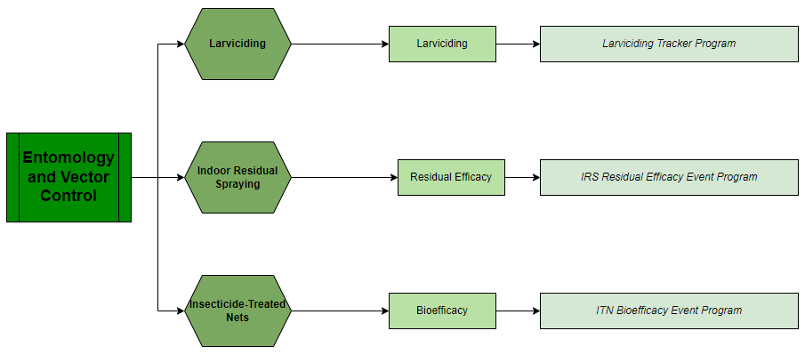

# Entomology & Vector Control - System Design Guide { #ento-vc}

## Background and Purpose

The DHIS2 standard modules for **Entomology and Vector Control (E&VC)** have been developed to support countries to improve the collection and use of entomological and vector control interventions data  to inform programmatic decisions.
All the modules have been designed in line with existing WHO recommendations, standard protocols and guidance. These modules complement already existing modules for [malaria epidemiology](https://who.dhis2.org/documentation/index.html#malaria). They contain a set of standard data collection forms, automatically calculated indicators, data visualizations and thematic dashboards that allow to collect, visualize and interpret data from the following activities in line with WHO recommendations:

- ITN bioefficacy monitoring,
- IRS residual efficacy monitoring,
- monitoring of mosquito larval habitats

The WHO configuration packages consist of DHIS2 metadata that provide standard configurations of DHIS2 to support the collection of health data following WHO recommendations.

## System Design Overview

### Use Case

With these modules, countries can:

- **collect data** from the field, insectaries or laboratories, using mobile phones, tablets or computers, online and offline, and geolocated;
- **integrate entomological and vector control data** with epidemiological data and other types of relevant data (e.g. climatological data, stock data);
- **calculate standard** entomological indicators automatically; and
- **develop custom visualizations** (tables, graphs and maps) and dashboard to inform specific needs.

### General Structure of the Activities

This chapter summarizes the published modules as of June 2022. It will be updated as more modules and packages are added to their respective E&VC activities.

The diagram provides an overview (from darker to lighter green) of the **activities, modules, and packages** currently available in the DHIS2 for E&VC. Further use cases and descriptions will be provided in the design guides of the modules.

### Rationale for Program Structure

Every standard method or procedure for the collection of entomological data and every vector control intervention is different and requires a different data collection process. For this reason, several modules have been developed, each to support a different entomological or vector control activity.  Such a modular approach allows countries to choose which modules to implement, depending on their national needs.

Entomological data is often collected through bioassays or mosquito collections that are repeated several times for the same place and time period (e.g multiple WHO cone bioassay for the monitoring of IRS efficacy can be conducted on the same day in different houses, several traps can be placed on the same night in different houses of a village to collect mosquitoes), in addition, some vector control activities require collecting data for the same geographical area over time (e.g. indoor spraying in several houses in one area on the same day). Therefore, the entomology and vector control modules make use of both event and tracker programs to meet the needs of entomologist and vector control specialists in the field.

During implementation in countries, modules are adopted to country needs to facilitate their field data collection.

### Intended Users

These packages are intended to be used by:

- **Field entomologists** and personnel involved in the implementation of vector control interventions to collect data on entomology and vector control activities
- **Laboratory technicians** to enter results on mosquito analysis
- Vector-borne disease **program managers and public health officers** to interpret the data collected and use such information during decision making processes.

## User Groups

| User group        | Dashboard         | Program Metadata  | Program data         |
|-------------------|-------------------|-------------------|----------------------|
| **ENTO-Admin**        | Can edit and view | Can edit and view | No Access            |
| **ENTO-Access**       | Can edit and view | Can view only     | Can view only        |
| **ENTO-Data capture** | No access         | Can view only     | Can capture and view |

## Android Compatibility

DHIS2 configuration packages are also compaitble with the DHIS2 Android Capture App, free to download on the GooglePlay store. Key considerations in design was to ensure that all forms are configured with sections that structure form layout for better display on the android devices. Also, with the requirement of minimal data disaggregation in this package, all the dataSet layout should provide a concise view for Android display.

## Data Triangulation - Entomology and Malaria

The data collected in the entomology and vector control programs can be triangulated with other DHIS2 health packages.
In Particular, the Larviciding tracker can be triangulated and analyzed against the information provided by the [malaria surveillance tracker for the follow up of foci](#mal-cs-design).
Other examples of possible data triangulations are the [IRS](#irs-activity) and [ITN](#itn-activity) packages can be triangulated between them to monitor the different efficacy campaigns and analyze their impacts, but their data can also be used to analyze in more depth either facility-based data like the information reported via the [malaria aggregate](#mal-agg-design) packages, or community-based data via the [CHIS package](#chis-system-design) for [malaria](#ch-mal-aggregate-design), [integrated community case management](#ch-iccm-aggregate-design) or [community-based surveillance](#ch-cbs-aggregate-design).
