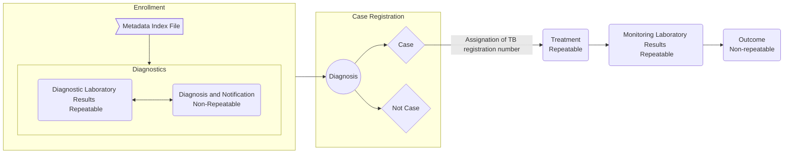

# Package Release Guide (Draft)

## Process

```mermaid
%%{init: {'mirrorActors': false } }%%

flowchart LR
  id1>Metadata Index File]
  id2(Diagnostic Laboratory Results <br> Repeatable)
  id3(Diagnosis and Notification <br> Non-Repeatable)
  id4((Diagnosis))
  id5{Case}
  id6{Not Case}
  id7(Treatment <br> Repeatable)
  id8(Monitoring Laboratory Results <br> Repeatable)
  id9(Outcome <br> Non-repeatable)
  click id1 "[https://www.github.com](https://docs.google.com/spreadsheets/d/1IIQL2IkGJqiIWLr6Bgg7p9fE78AwQYhHBNGoV-spGOM/edit?usp=sharing)" "This is a tooltip for a link"
  click id1 href "https://docs.google.com/spreadsheets/d/1IIQL2IkGJqiIWLr6Bgg7p9fE78AwQYhHBNGoV-spGOM/edit?usp=sharing" _blank
  subgraph Enrollment
    subgraph Diagnostics
       id2 <--> id3
    end
    id1 --> Diagnostics
  end
  subgraph Case Registration
    direction LR
    id4 --> id5
    id4 --> id6
  end
  Enrollment --> id4
  id5 -- Assignation of TB registration number --> id7
  id7 --> id8
  id8 --> id9
  
```
